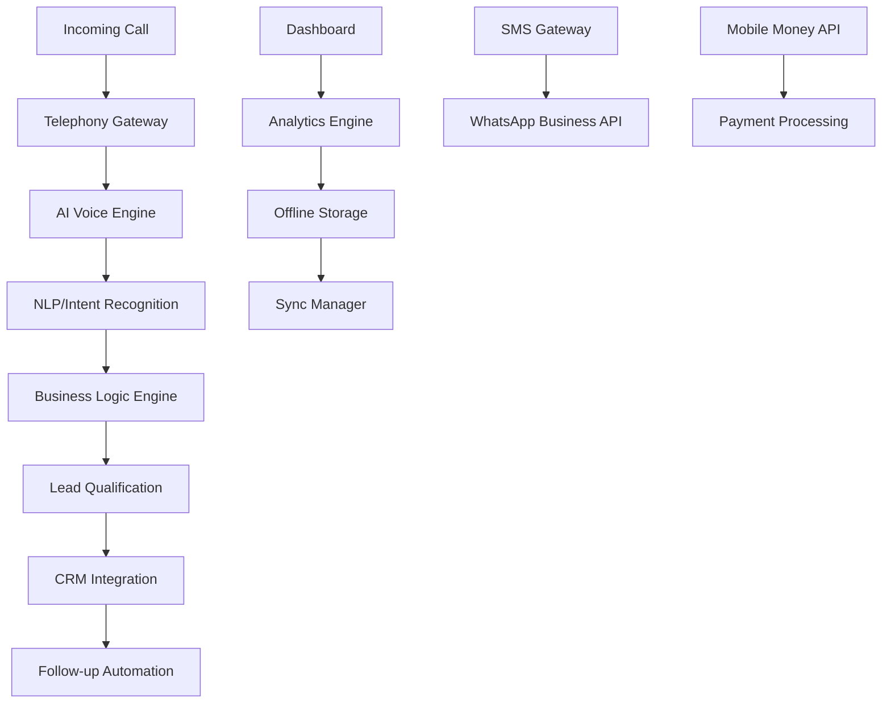

# AfriCall: AI-Powered Call Answering & Lead Conversion System for Africa

## 🌍 Problem Statement

### Core Challenge
African businesses lose 60-80% of potential leads due to:
- **Unreliable human availability** (power outages, connectivity issues)
- **Language barriers** (11 official languages in South Africa alone)
- **Limited business hours** while customers call 24/7
- **High staff turnover** affecting call quality consistency
- **Poor call tracking** leading to missed follow-ups
- **Manual lead qualification** causing delays and lost opportunities

### Market Gap
- CallRail doesn't support African phone numbers or local payment methods
- Existing solutions are expensive ($50-200/month) for SMEs
- No African language support or cultural context understanding
- Poor connectivity handling for intermittent internet
- Limited integration with local CRM/payment systems

### Target Users
- **SMEs** (restaurants, salons, mechanics, retail)
- **Service providers** (plumbers, electricians, contractors) 
- **Healthcare practices** (clinics, dentists)
- **Real estate agents**
- **E-commerce businesses**
- **Call centers** needing overflow support

---

## 🎯 Solution Overview

**AfriCall** - An AI-powered call management system that works even when humans sleep or can't answer, specifically designed for African market challenges.

### Core Value Proposition
> "Your business never sleeps. Our AI answers every call, speaks your customers' language, and converts leads while you focus on what matters most."

### Key Differentiators
- **Offline-first design** with sync when connected
- **Multi-language AI** (English, Afrikaans, Swahili, French, Arabic)
- **Mobile money integration** (M-Pesa, Airtel Money)
- **SMS fallback** for poor connectivity
- **Local phone number support**
- **Ultra-low cost** ($5-15/month pricing)

---

## 🏗️ Technical Architecture

### System Components



### Technology Stack

#### Backend
- **Language**: Python 3.11+ (FastAPI + SQLAlchemy)
- **Database**: PostgreSQL + Redis (caching)
- **AI/ML**: 
  - OpenAI Whisper (speech-to-text)
  - Custom fine-tuned models for African languages
  - Rasa/Dialogflow for conversation management
- **Telephony**: Twilio/Vonage (with African carrier partnerships)
- **Queue System**: Celery + Redis

#### Frontend
- **Web Dashboard**: React.js + TypeScript
- **Mobile App**: React Native (offline-capable)
- **Real-time**: WebSockets (Socket.io)

#### Infrastructure
- **Hosting**: DigitalOcean/AWS (Cape Town region)
- **CDN**: Cloudflare (African POPs)
- **Monitoring**: Sentry + Prometheus
- **CI/CD**: GitHub Actions

---

## 🔧 Core Features

### 1. AI Call Handler
- **Instant pickup** (< 2 rings)
- **Natural conversation** in local languages
- **Context awareness** (business type, time, caller history)
- **Intelligent routing** to humans when needed
- **Call recording & transcription**

### 2. Lead Qualification Engine
- **Dynamic questioning** based on business rules
- **Lead scoring algorithm**
- **Appointment scheduling**
- **Price quotation delivery**
- **Follow-up task creation**

### 3. Multi-Channel Communication
- **Voice calls** (primary)
- **SMS notifications** 
- **WhatsApp messages**
- **Email sequences**
- **USSD integration** (for feature phones)

### 4. Business Intelligence
- **Call analytics dashboard**
- **Conversion rate tracking**
- **Peak hours identification**
- **Lead source attribution**
- **ROI calculations**

### 5. Integration Hub
- **Local CRMs** (Salesforce, HubSpot)
- **Accounting software** (QuickBooks, Xero)
- **Mobile money** (M-Pesa, Airtel Money)
- **Local directories** (Google My Business, Yellow Pages)

---

## 📱 Mobile-First Design

### Offline Capabilities
- **Local data storage** (SQLite)
- **Queue system** for pending actions
- **Automatic sync** when online
- **SMS alerts** for critical events
- **USSD dashboard** access

### Progressive Web App
- **Installable** on any smartphone
- **Push notifications**
- **Camera integration** (QR codes)
- **Geolocation** (for field services)

---

## 🗣️ African Language Support

### Phase 1 Languages
- **English** (primary)
- **Afrikaans** 
- **Swahili**
- **French** (West/Central Africa)
- **Arabic** (North Africa)

### Phase 2 Expansion
- **Zulu, Xhosa** (South Africa)
- **Yoruba, Igbo** (Nigeria)
- **Amharic** (Ethiopia)
- **Hausa** (West Africa)

### Implementation Strategy
- **Pre-trained models** fine-tuned with African datasets
- **Accent adaptation** for regional variations
- **Code-switching support** (mixing languages)
- **Cultural context** understanding

---

## 💰 Monetization Strategy

### Pricing Tiers (Monthly, USD)

#### Starter ($5/month)
- 100 AI-handled calls
- Basic analytics
- SMS notifications
- Single language
- Standard support

#### Professional ($15/month)
- 500 AI-handled calls
- Advanced analytics
- Multi-channel communication
- 3 languages
- WhatsApp integration
- Priority support

#### Enterprise ($40/month)
- Unlimited calls
- Custom integrations
- All languages
- Mobile money integration
- Dedicated account manager
- API access

### Revenue Streams
1. **Monthly subscriptions** (70% of revenue)
2. **Pay-per-call** overage fees (15%)
3. **Integration services** (10%)
4. **White-label licensing** (5%)

---

## 🛠️ MVP Development Plan

### Phase 1: Foundation (Weeks 1-8)
- [ ] Basic telephony integration (Twilio)
- [ ] Simple AI call handler (English only)
- [ ] Lead capture form
- [ ] Basic dashboard
- [ ] SMS notifications

### Phase 2: Intelligence (Weeks 9-16)
- [ ] Advanced NLP/intent recognition
- [ ] Lead qualification engine
- [ ] Call analytics
- [ ] Multi-language support (Afrikaans, Swahili)
- [ ] WhatsApp integration

### Phase 3: Scale (Weeks 17-24)
- [ ] Mobile app (React Native)
- [ ] Offline functionality
- [ ] Advanced integrations (CRM, payments)
- [ ] Business intelligence dashboard
- [ ] Enterprise features

### Phase 4: Expansion (Weeks 25-32)
- [ ] Additional languages
- [ ] USSD integration
- [ ] Mobile money payments
- [ ] White-label solution
- [ ] Advanced AI features

---

## 🚀 Go-to-Market Strategy

### Target Market Entry
1. **South Africa** (English/Afrikaans speakers)
2. **Kenya** (English/Swahili speakers)  
3. **Nigeria** (English speakers)
4. **Morocco** (French/Arabic speakers)

### Customer Acquisition
- **Digital marketing** (Facebook, Google Ads in local languages)
- **Partner channels** (telcos, business associations)
- **Referral program** (2 months free for each referral)
- **Content marketing** (blog, YouTube in local languages)
- **Trade shows** and business events

### Distribution Strategy
- **Direct sales** (online signup)
- **Partner networks** (telcos, system integrators)
- **Reseller programs** (local IT companies)
- **Mobile money partnerships** for easy payments

---

## 🔒 Technical Implementation

### Core Backend Services

#### 1. Call Handler Service
```python
# call_handler/models.py
class CallSession(models.Model):
    phone_number = models.CharField(max_length=20)
    language = models.CharField(max_length=10, default='en')
    business = models.ForeignKey(Business, on_delete=models.CASCADE)
    status = models.CharField(max_length=20)
    ai_confidence = models.FloatField()
    transcript = models.TextField(blank=True)
    created_at = models.DateTimeField(auto_now_add=True)

class Lead(models.Model):
    call_session = models.ForeignKey(CallSession, on_delete=models.CASCADE)
    name = models.CharField(max_length=100, blank=True)
    email = models.EmailField(blank=True)
    service_needed = models.CharField(max_length=200)
    budget = models.DecimalField(max_digits=10, decimal_places=2, null=True)
    urgency = models.CharField(max_length=20)
    score = models.IntegerField(default=0)
    status = models.CharField(max_length=20, default='new')
```

#### 2. AI Voice Engine
```python
# ai_engine/voice_handler.py
import openai
from twilio.twiml import VoiceResponse
import speech_recognition as sr
from fastapi import HTTPException

class AIVoiceHandler:
    def __init__(self, language='en', business_context=None):
        self.language = language
        self.context = business_context
        
    async def handle_call(self, call_sid: str, caller_number: str):
        response = VoiceResponse()
        
        # Greeting in appropriate language
        greeting = await self.get_greeting()
        response.say(greeting, language=self.language)
        
        # Start conversation loop
        response.gather(
            action=f'/handle-response/{call_sid}',
            method='POST',
            speech_timeout='auto'
        )
        
        return str(response)
    
    async def process_speech(self, audio_data):
        # Convert speech to text
        transcript = await self.speech_to_text(audio_data)
        
        # Process intent
        intent = await self.extract_intent(transcript)
        
        # Generate response
        ai_response = await self.generate_response(intent, transcript)
        
        return ai_response
```

#### 3. Lead Qualification Engine
```python
# leads/qualification.py
from typing import Dict, Any
from pydantic import BaseModel

class QualificationResult(BaseModel):
    status: str
    score: int
    action: str
    confidence: float

class LeadQualificationEngine:
    def __init__(self, business_rules: Dict[str, Any]):
        self.rules = business_rules
        
    async def qualify_lead(self, conversation_data: Dict[str, Any]) -> QualificationResult:
        score = 0
        
        # Extract key information
        budget = await self.extract_budget(conversation_data)
        timeline = await self.extract_timeline(conversation_data)
        needs = await self.extract_needs(conversation_data)
        
        # Score based on business rules
        if budget and budget >= self.rules.get('min_budget', 0):
            score += 30
            
        if timeline in ['urgent', 'this_week']:
            score += 25
            
        # Decision tree for next actions
        if score >= 70:
            return QualificationResult(
                status='hot',
                score=score,
                action='immediate_callback',
                confidence=0.9
            )
        elif score >= 40:
            return QualificationResult(
                status='warm', 
                score=score,
                action='schedule_follow_up',
                confidence=0.7
            )
        else:
            return QualificationResult(
                status='cold',
                score=score,
                action='nurture_sequence',
                confidence=0.5
            )
```

### Frontend Dashboard

#### React Components Structure
```javascript
// components/Dashboard.tsx
import React, { useEffect, useState } from 'react';
import { CallMetrics } from './CallMetrics';
import { LeadsPipeline } from './LeadsPipeline';
import { RealtimeActivity } from './RealtimeActivity';

const Dashboard: React.FC = () => {
    const [data, setData] = useState(null);
    const [isOffline, setIsOffline] = useState(false);
    
    useEffect(() => {
        // Load data from local storage if offline
        if (!navigator.onLine) {
            setIsOffline(true);
            loadOfflineData();
        } else {
            fetchLiveData();
        }
    }, []);
    
    return (
        <div className="dashboard">
            {isOffline && <OfflineBanner />}
            <CallMetrics data={data?.metrics} />
            <LeadsPipeline leads={data?.leads} />
            <RealtimeActivity activity={data?.activity} />
        </div>
    );
};
```

### Mobile App (React Native)

#### Offline-First Architecture
```javascript
// services/OfflineManager.js
import AsyncStorage from '@react-native-async-storage/async-storage';
import NetInfo from '@react-native-netinfo/netinfo';

class OfflineManager {
    constructor() {
        this.pendingActions = [];
        this.isOnline = true;
        
        NetInfo.addEventListener(state => {
            this.isOnline = state.isConnected;
            if (this.isOnline) {
                this.syncPendingActions();
            }
        });
    }
    
    async storeAction(action) {
        if (this.isOnline) {
            return await this.executeAction(action);
        } else {
            this.pendingActions.push(action);
            await AsyncStorage.setItem('pendingActions', 
                JSON.stringify(this.pendingActions));
        }
    }
    
    async syncPendingActions() {
        const stored = await AsyncStorage.getItem('pendingActions');
        if (stored) {
            const actions = JSON.parse(stored);
            for (const action of actions) {
                await this.executeAction(action);
            }
            await AsyncStorage.removeItem('pendingActions');
        }
    }
}
```

---

## 📊 Database Schema

### Core Tables
```sql
-- businesses table
CREATE TABLE businesses (
    id UUID PRIMARY KEY DEFAULT gen_random_uuid(),
    name VARCHAR(255) NOT NULL,
    phone_numbers TEXT[], -- Array of tracked numbers
    business_type VARCHAR(100),
    languages VARCHAR(50)[] DEFAULT ARRAY['en'],
    timezone VARCHAR(50) DEFAULT 'Africa/Johannesburg',
    settings JSONB DEFAULT '{}',
    created_at TIMESTAMP DEFAULT NOW()
);

-- call_sessions table
CREATE TABLE call_sessions (
    id UUID PRIMARY KEY DEFAULT gen_random_uuid(),
    business_id UUID REFERENCES businesses(id),
    caller_number VARCHAR(20),
    tracking_number VARCHAR(20),
    language VARCHAR(10) DEFAULT 'en',
    duration INTEGER, -- seconds
    status VARCHAR(20) DEFAULT 'active',
    ai_handled BOOLEAN DEFAULT true,
    transcript TEXT,
    sentiment_score FLOAT,
    created_at TIMESTAMP DEFAULT NOW()
);

-- leads table
CREATE TABLE leads (
    id UUID PRIMARY KEY DEFAULT gen_random_uuid(),
    call_session_id UUID REFERENCES call_sessions(id),
    business_id UUID REFERENCES businesses(id),
    name VARCHAR(255),
    phone VARCHAR(20),
    email VARCHAR(255),
    service_needed VARCHAR(500),
    budget_min INTEGER,
    budget_max INTEGER,
    timeline VARCHAR(50),
    qualification_score INTEGER DEFAULT 0,
    status VARCHAR(20) DEFAULT 'new',
    assigned_to UUID,
    next_follow_up TIMESTAMP,
    created_at TIMESTAMP DEFAULT NOW()
);

-- follow_up_tasks table
CREATE TABLE follow_up_tasks (
    id UUID PRIMARY KEY DEFAULT gen_random_uuid(),
    lead_id UUID REFERENCES leads(id),
    task_type VARCHAR(50), -- call, sms, email, whatsapp
    scheduled_for TIMESTAMP,
    status VARCHAR(20) DEFAULT 'pending',
    message_template TEXT,
    completed_at TIMESTAMP,
    created_at TIMESTAMP DEFAULT NOW()
);
```

---

## 🌐 API Design

### RESTful API Endpoints

#### Authentication
```
POST /api/v1/auth/login
POST /api/v1/auth/register
POST /api/v1/auth/refresh-token
DELETE /api/v1/auth/logout
```

#### Business Management
```
GET    /api/v1/businesses/me
PATCH  /api/v1/businesses/me
GET    /api/v1/businesses/me/phone-numbers
POST   /api/v1/businesses/me/phone-numbers
DELETE /api/v1/businesses/me/phone-numbers/{id}
```

#### Call Management
```
GET    /api/v1/calls?page=1&limit=50&status=completed
GET    /api/v1/calls/{id}
POST   /api/v1/calls/{id}/notes
GET    /api/v1/calls/analytics?period=30d
```

#### Lead Management
```
GET    /api/v1/leads?status=new&sort=-created_at
GET    /api/v1/leads/{id}
PATCH  /api/v1/leads/{id}
POST   /api/v1/leads/{id}/follow-up
GET    /api/v1/leads/{id}/timeline
```

#### Webhook Endpoints
```
POST /api/v1/webhooks/twilio/voice
POST /api/v1/webhooks/twilio/sms
POST /api/v1/webhooks/whatsapp
```

---

## 🔧 Development Environment Setup

### Prerequisites
```bash
# System requirements
Python 3.11+
Node.js 18+
PostgreSQL 14+
Redis 7+
```

### Backend Setup
```bash
# Clone repository
git clone https://github.com/yourusername/africall.git
cd africall

# Create virtual environment
python -m venv venv
source venv/bin/activate  # Linux/Mac
# or: venv\Scripts\activate  # Windows

# Install dependencies
pip install -r requirements.txt

# Environment variables
cp .env.example .env
# Edit .env with your configuration

# Database setup (using Alembic)
alembic upgrade head

# Start development server
uvicorn main:app --reload --port 8000
```

### Frontend Setup
```bash
# Navigate to frontend directory
cd frontend

# Install dependencies
npm install

# Environment setup
cp .env.example .env.local
# Edit .env.local with your API endpoints

# Start development server
npm run dev
```

### Mobile App Setup
```bash
# Navigate to mobile directory
cd mobile

# Install dependencies
npm install

# iOS setup (Mac only)
cd ios && pod install && cd ..

# Start Metro bundler
npm start

# Run on device/simulator
npm run android  # Android
npm run ios      # iOS
```

---

## 🧪 Testing Strategy

### Unit Tests
```python
# tests/test_call_handler.py
import pytest
from fastapi.testclient import TestClient
from sqlalchemy.orm import Session
from main import app
from models import CallSession, Lead
from ai_engine.voice_handler import AIVoiceHandler

client = TestClient(app)

class TestAIVoiceHandler:
    @pytest.fixture
    def handler(self):
        return AIVoiceHandler(language='en')
    
    @pytest.mark.asyncio
    async def test_greeting_generation(self, handler):
        greeting = await handler.get_greeting()
        assert 'Hello' in greeting
        assert 'how can i help' in greeting.lower()
    
    @pytest.mark.asyncio
    async def test_lead_qualification(self, handler):
        conversation = {
            'transcript': 'I need a plumber urgently, budget is $500',
            'caller_info': {'phone': '+27123456789'}
        }
        
        result = await handler.qualify_lead(conversation)
        assert result.score >= 70
        assert result.status == 'hot'
```

### Integration Tests
```javascript
// tests/integration/call-flow.test.js
const request = require('supertest');
const app = require('../../app');

describe('Call Flow Integration', () => {
    test('Complete call journey', async () => {
        // Simulate incoming call
        const callResponse = await request(app)
            .post('/api/v1/webhooks/twilio/voice')
            .send({ From: '+27123456789', To: '+27987654321' })
            .expect(200);
        
        expect(callResponse.body).toContain('<Say>');
        
        // Simulate speech input
        const speechResponse = await request(app)
            .post('/api/v1/calls/handle-speech')
            .send({ 
                CallSid: 'test-call-sid',
                SpeechResult: 'I need a plumber' 
            })
            .expect(200);
        
        // Verify lead creation
        const leads = await request(app)
            .get('/api/v1/leads')
            .expect(200);
        
        expect(leads.body.results.length).toBeGreaterThan(0);
    });
});
```

---

## 📈 Analytics & Monitoring

### Key Metrics Dashboard
```javascript
// analytics/metrics.js
export const KPIs = {
    // Call Metrics
    callVolume: 'Total calls received',
    answerRate: 'Percentage of calls answered by AI',
    avgCallDuration: 'Average call length',
    callResolution: 'Calls resolved without human intervention',
    
    // Lead Metrics  
    leadConversion: 'Calls that generated qualified leads',
    leadQuality: 'Average lead qualification score',
    followUpRate: 'Percentage of leads followed up',
    
    // Business Metrics
    revenue: 'Revenue attributed to AI-handled leads',
    costPerLead: 'Cost efficiency vs traditional methods',
    customerSatisfaction: 'Post-call satisfaction scores'
};
```

### Performance Monitoring
```python
# monitoring/performance.py
import time
import asyncio
from functools import wraps
from typing import Any, Callable
import redis
import logging

logger = logging.getLogger(__name__)
redis_client = redis.Redis(host='localhost', port=6379, db=0)

def monitor_performance(metric_name: str):
    def decorator(func: Callable) -> Callable:
        @wraps(func)
        async def async_wrapper(*args: Any, **kwargs: Any) -> Any:
            start_time = time.time()
            
            try:
                if asyncio.iscoroutinefunction(func):
                    result = await func(*args, **kwargs)
                else:
                    result = func(*args, **kwargs)
                status = 'success'
                return result
            except Exception as e:
                status = 'error'
                logger.error(f'{metric_name} failed: {str(e)}')
                raise
            finally:
                duration = time.time() - start_time
                
                # Store metrics in Redis
                redis_client.setex(f'metric_{metric_name}_duration', 300, duration)
                redis_client.setex(f'metric_{metric_name}_status', 300, status)
                
                # Log performance
                logger.info(f'{metric_name} completed in {duration:.2f}s with {status}')
                
        return async_wrapper
    return decorator

@monitor_performance('ai_call_processing')
async def process_ai_call(call_data: dict) -> dict:
    # AI processing logic
    await asyncio.sleep(0.1)  # Simulate processing
    return {"status": "processed"}
```

---

## 🚀 Deployment Strategy

### Infrastructure as Code
```yaml
# docker-compose.yml
version: '3.8'

services:
  db:
    image: postgres:14
    environment:
      POSTGRES_DB: africall
      POSTGRES_USER: africall
      POSTGRES_PASSWORD: ${DB_PASSWORD}
    volumes:
      - postgres_data:/var/lib/postgresql/data
    ports:
      - "5432:5432"

  redis:
    image: redis:7-alpine
    ports:
      - "6379:6379"

  backend:
    build: .
    environment:
      - DATABASE_URL=postgresql://africall:${DB_PASSWORD}@db:5432/africall
      - REDIS_URL=redis://redis:6379/0
    depends_on:
      - db
      - redis
    ports:
      - "8000:8000"
    command: uvicorn main:app --host 0.0.0.0 --port 8000

  celery:
    build: .
    command: celery -A africall worker -l info
    environment:
      - DATABASE_URL=postgresql://africall:${DB_PASSWORD}@db:5432/africall
      - REDIS_URL=redis://redis:6379/0
    depends_on:
      - db
      - redis

  nginx:
    image: nginx:alpine
    ports:
      - "80:80"
      - "443:443"
    volumes:
      - ./nginx.conf:/etc/nginx/nginx.conf
      - ./ssl:/etc/ssl
    depends_on:
      - backend

volumes:
  postgres_data:
```

### Kubernetes Deployment (Production)
```yaml
# k8s/deployment.yaml
apiVersion: apps/v1
kind: Deployment
metadata:
  name: africall-backend
spec:
  replicas: 3
  selector:
    matchLabels:
      app: africall-backend
  template:
    metadata:
      labels:
        app: africall-backend
    spec:
      containers:
      - name: backend
        image: africall/backend:latest
        ports:
        - containerPort: 8000
        env:
        - name: DATABASE_URL
          valueFrom:
            secretKeyRef:
              name: africall-secrets
              key: database-url
        - name: REDIS_URL
          valueFrom:
            secretKeyRef:
              name: africall-secrets  
              key: redis-url
        resources:
          limits:
            memory: "512Mi"
            cpu: "500m"
          requests:
            memory: "256Mi" 
            cpu: "250m"
---
apiVersion: v1
kind: Service
metadata:
  name: africall-service
spec:
  selector:
    app: africall-backend
  ports:
  - protocol: TCP
    port: 80
    targetPort: 8000
  type: LoadBalancer
```

---

## 🔒 Security & Compliance

### Data Protection
- **Encryption**: AES-256 for data at rest, TLS 1.3 for transit
- **PII Handling**: GDPR/POPIA compliant data processing
- **Call Recording**: Encrypted storage with automatic deletion policies
- **API Security**: JWT tokens, rate limiting, input validation

### African Compliance
- **POPIA** (Protection of Personal Information Act) - South Africa
- **DPA** (Data Protection Act) - Kenya  
- **NDPR** (Nigeria Data Protection Regulation)
- **Local telecom regulations** per country

### Security Implementation
```python
# security/middleware.py
import jwt
import time
from fastapi import Request, HTTPException, status
from fastapi.responses import JSONResponse
from starlette.middleware.base import BaseHTTPMiddleware
from typing import Dict
import redis

redis_client = redis.Redis(host='localhost', port=6379, db=1)

class SecurityMiddleware(BaseHTTPMiddleware):
    def __init__(self, app, rate_limit: int = 100):
        super().__init__(app)
        self.rate_limit = rate_limit
    
    async def dispatch(self, request: Request, call_next):
        # Rate limiting
        client_ip = request.client.host
        if await self.is_rate_limited(client_ip):
            return JSONResponse(
                status_code=429,
                content={'error': 'Rate limit exceeded'}
            )
        
        # API authentication for /api/ endpoints
        if request.url.path.startswith('/api/'):
            token = self.get_auth_token(request)
            if not await self.validate_token(token):
                return JSONResponse(
                    status_code=401,
                    content={'error': 'Invalid token'}
                )
        
        response = await call_next(request)
        
        # Security headers
        response.headers['X-Content-Type-Options'] = 'nosniff'
        response.headers['X-Frame-Options'] = 'DENY' 
        response.headers['X-XSS-Protection'] = '1; mode=block'
        
        return response
    
    async def is_rate_limited(self, client_ip: str) -> bool:
        key = f"rate_limit:{client_ip}"
        current = redis_client.get(key)
        
        if current is None:
            redis_client.setex(key, 3600, 1)  # 1 hour window
            return False
        
        if int(current) >= self.rate_limit:
            return True
            
        redis_client.incr(key)
        return False
    
    def get_auth_token(self, request: Request) -> str:
        auth_header = request.headers.get('Authorization')
        if not auth_header or not auth_header.startswith('Bearer '):
            return None
        return auth_header.split(' ')[1]
    
    async def validate_token(self, token: str) -> bool:
        if not token:
            return False
        try:
            # Add your JWT validation logic here
            decoded = jwt.decode(token, "your-secret-key", algorithms=["HS256"])
            return True
        except jwt.InvalidTokenError:
            return False
```

---

## 📋 Success Metrics

### Technical KPIs
- **Uptime**: 99.9% availability
- **Response Time**: < 2 seconds to answer calls
- **AI Accuracy**: > 85% intent recognition 
- **Scalability**: Handle 1000+ concurrent calls

### Business KPIs
- **Customer Acquisition**: 1000+ businesses in Year 1
- **Revenue**: $100K ARR by Month 12
- **Lead Quality**: 70%+ qualified leads
- **Customer Satisfaction**: 4.5/5 rating

### Market Impact
- **Jobs Created**: 50+ direct, 200+ indirect
- **SME Growth**: Help 5000+ businesses grow
- **Economic Impact**: $10M+ in additional business revenue

---

## 🤝 Contributing

### Development Workflow
1. Fork the repository
2. Create feature branch (`git checkout -b feature/amazing-feature`)
3. Commit changes (`git commit -m 'Add amazing feature'`)
4. Push branch (`git push origin feature/amazing-feature`)  
5. Open Pull Request

### Code Standards
- **Python**: PEP 8, type hints, docstrings
- **JavaScript**: ESLint + Prettier
- **Testing**: 80%+ code coverage
- **Documentation**: Every public method documented

---

## 📞 Contact & Support

### Development Team
- **Lead Developer**: [Your Name] - your.email@africall.com
- **AI/ML Engineer**: TBH
- **Mobile Developer**: TBH  
- **DevOps Engineer**: TBH

### Community
- **GitHub**: https://github.com/africall/core
- **Discord**: https://discord.gg/africall
- **Blog**: https://blog.africall.com
- **Support**: support@africall.com

---

## 📄 License

MIT License - See LICENSE file for details

---

*Built with ❤️ for African businesses by African developers*

**"Empowering African entrepreneurs to never miss an opportunity"**
